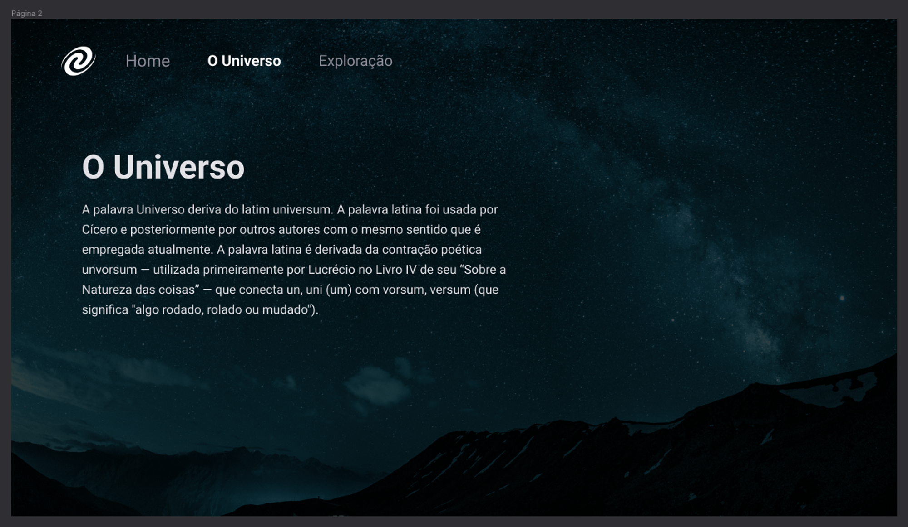

<h1 align="center"> SPA Universe </h1>

  <a href="#technologies">Technologies</a>&nbsp;&nbsp;&nbsp;|&nbsp;&nbsp;&nbsp;
  <a href="#project">Project</a>&nbsp;&nbsp;&nbsp;|&nbsp;&nbsp;&nbsp;
  <a href="#how-to-use">How to Use</a>&nbsp;&nbsp;&nbsp;|&nbsp;&nbsp;&nbsp;
  <a href="#license">License</a>&nbsp;&nbsp;&nbsp;|&nbsp;&nbsp;&nbsp;
  <a href="#readme-in-portuguese">README in Portuguese</a>

  

  
  

  

## Technologies

- HTML
- CSS
- JavaScript
- Git and GitHub
- Figma

## Project

This is a SPA (Single Page Application) project developed to present information about the universe and space exploration.

### Features

The project features the following functionalities:

- Navigation between pages using links on the navigation menu
- Updating page content without the need to reload the entire page
- `Home` page 
- `The Universe` page with information about the universe, its features, and curiosities
- `Exploration` page with information about space missions carried out by NASA and other space agencies around the world

## How to Use

To access the finished project, [click here](https://fernandoalvesrufino.github.io/spa-universe/).

## License
This project is under the MIT license.

---

by Fernando Rufino

`Project created by Rocketseat`

# README in portuguese

<h1 align="center"> SPA Universe </h1>

  <a href="#tecnologias">Tecnologias</a>&nbsp;&nbsp;&nbsp;|&nbsp;&nbsp;&nbsp;
  <a href="#projeto">Projeto</a>&nbsp;&nbsp;&nbsp;|&nbsp;&nbsp;&nbsp;
  <a href="#como-usar">Como Usar</a>&nbsp;&nbsp;&nbsp;|&nbsp;&nbsp;&nbsp;
  <a href="#licença">Licença</a>

  

 

  

## Tecnologias

- HTML
- CSS
- JavaScript
- Git e GitHub
- Figma

## Projeto

Este é um projeto de uma SPA (Single Page Application) desenvolvida para apresentar informações sobre o universo e a exploração espacial.

### Funcionalidades
O projeto apresenta as seguintes funcionalidades:

- Navegação entre as páginas usando links no menu de navegação
- Atualização do conteúdo da página sem a necessidade de recarregar a página inteira
- Página `Home`
- Página `O Universo` com informações sobre o universo, suas características e curiosidades
- Página `Exploração` com informações sobre as missões espaciais realizadas pela NASA e outras agências espaciais ao redor do mundo

## Como Usar

- Para acessar ao projeto finalizado, [clique aqui](https://fernandoalvesrufino.github.io/spa-universe/).

## Licença

Esse projeto está sob a licença MIT.

---

by Fernando Rufino

`Projeto criado pela Rocketseat`
